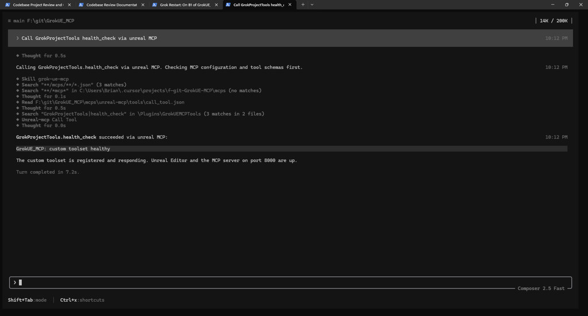
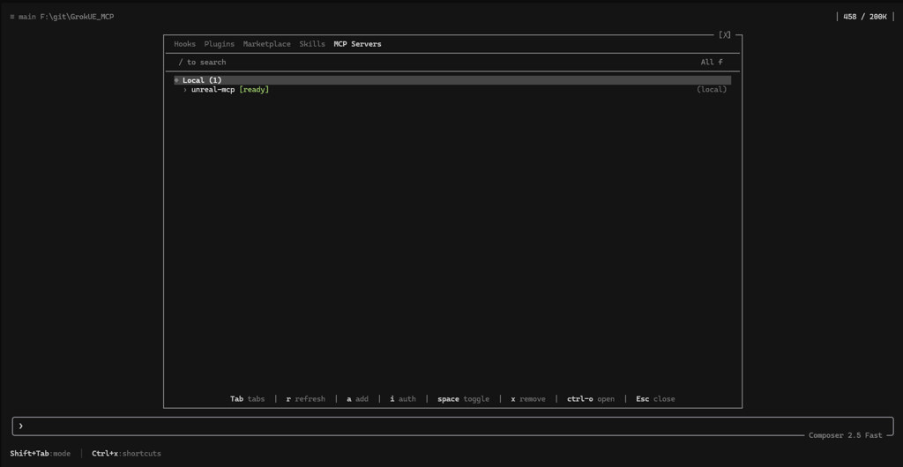
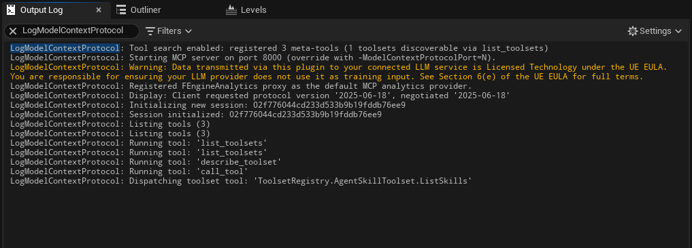
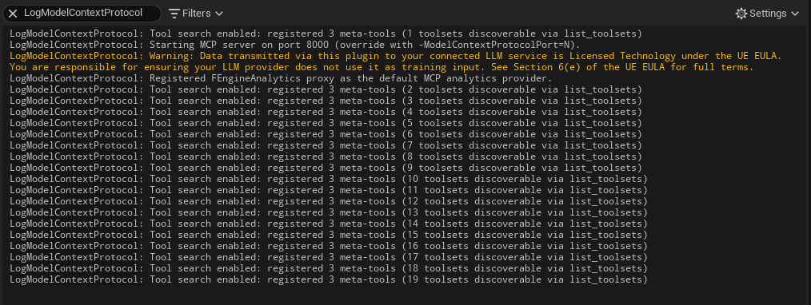
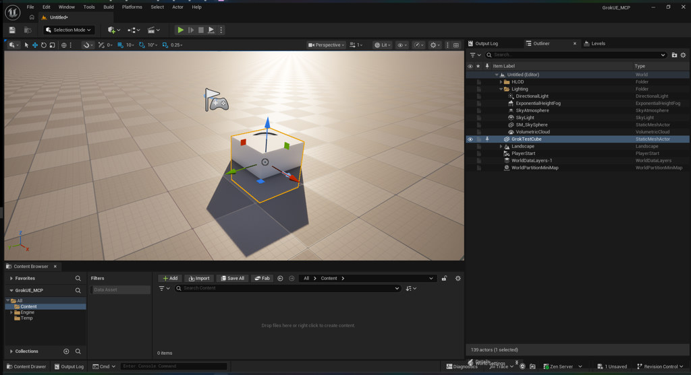
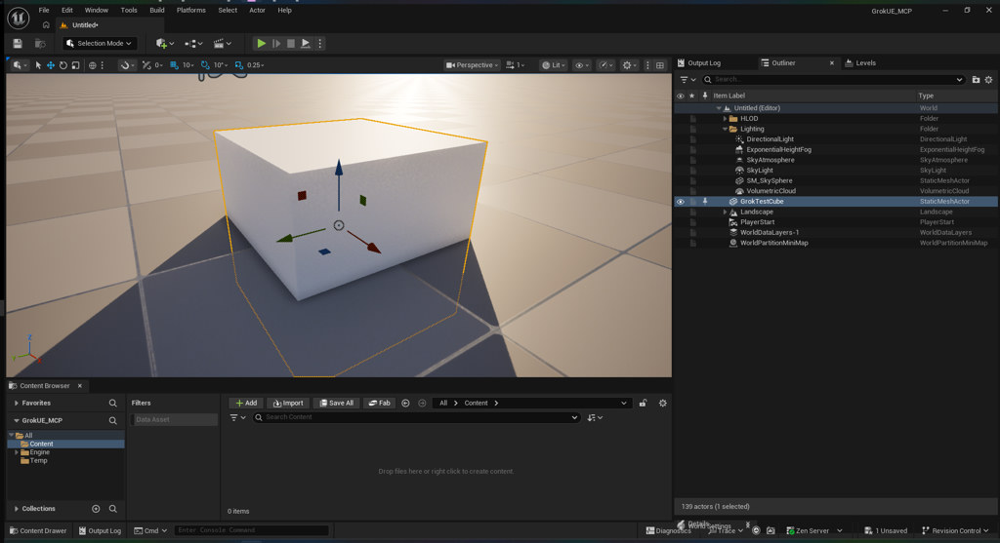
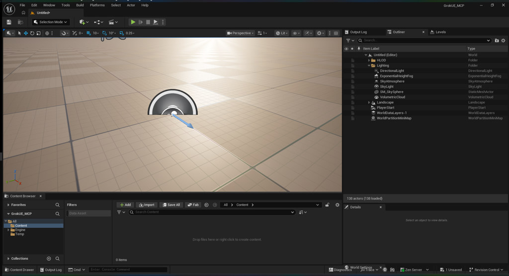
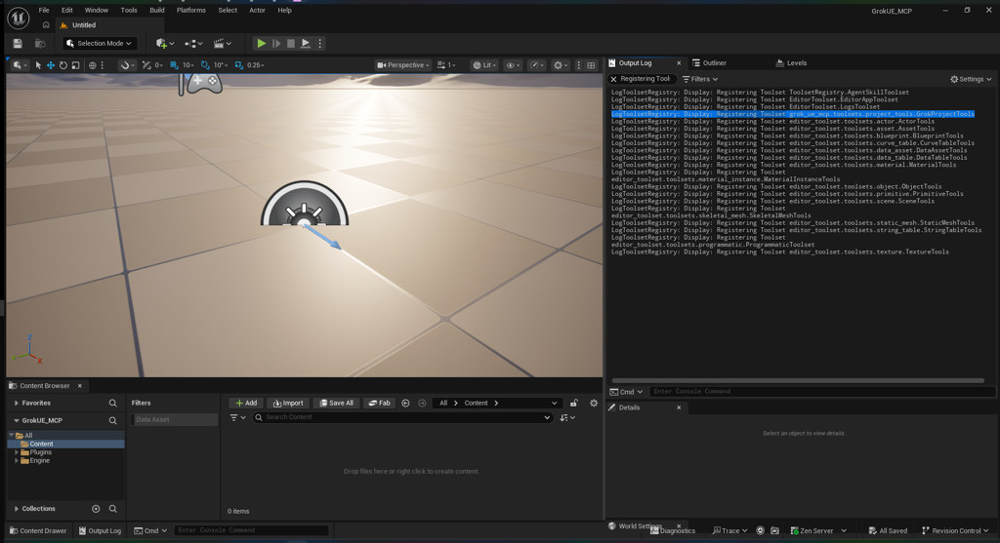

# GrokUE_MCP — Integration Notes

**Last updated:** 2026-06-20  
**Current phase:** Integration **complete** (Phases 0–5 pass). Ready for daily use and feature work.

This file records what we verified, what failed, and answers to open questions from [PLAN.md](PLAN.md). Update it as each phase completes.

---

## Handoff — new Grok session starts here

**You are picking up a finished integration.** The Grok ↔ Unreal MCP bridge is verified. Read this section first, then drive from `AGENTS.md` and the `/grok-ue-mcp` skill.

### 1. Confirm the session (30 seconds)

| Step | Action |
|------|--------|
| UE running? | `GrokUE_MCP.uproject` open; Output Log shows MCP on port **8000** |
| Grok from repo root? | `cd F:\git\GrokUE_MCP` → `grok` |
| MCP ready? | `/mcps` → `unreal-mcp` **[ready]** — press **`r`** after any editor restart |
| Health check | `call_tool` → `GrokProjectTools.health_check` → `GrokUE_MCP: custom toolset healthy` |



*Verified 2026-06-20: new Grok session → `GrokProjectTools.health_check` via `unreal-mcp`.*

### 2. What is already done (do not re-run unless regressing)

| Phase | Result |
|-------|--------|
| 0–2 | UE 5.8 + MCP + Grok connected |
| 3 | Batches A/B/C — meta-tools, scene read, spawn/focus/remove cube ([screenshots](images/)) |
| 4 | Daily startup/shutdown workflow adopted |
| 5 | `AGENTS.md`, `/grok-ue-mcp` skill, custom `GrokUEMCPTools` plugin (**20 toolsets**) |

### 3. Where to work next

| Goal | Start here |
|------|------------|
| Daily Grok + UE work | `AGENTS.md` + `/grok-ue-mcp` |
| Add project MCP tools | `Plugins/GrokUEMCPTools/Content/Python/grok_ue_mcp/toolsets/project_tools.py` → editor restart → `ModelContextProtocol.RefreshTools` |
| Custom tool authoring rules | `@unreal.ustruct()` for struct returns — **not** `@dataclass` (see Phase 5 hitch below) |
| Gameplay / content | `Content/` (blank today) |
| CI / headless MCP | `Docs/PLAN.md` Phase 5 — `-ModelContextProtocolStartServer` (not started) |

### 4. Key repo paths

```
F:\git\GrokUE_MCP\
├── AGENTS.md                          # Agent conventions — read first
├── .grok/config.toml                  # unreal-mcp → http://127.0.0.1:8000/mcp
├── .grok/skills/grok-ue-mcp/          # /grok-ue-mcp skill
├── Plugins/GrokUEMCPTools/            # Custom Python MCP toolset
├── Docs/NOTES.md                      # This file — test results + handoff
└── Docs/PLAN.md                       # Full integration plan
```

### 5. If something breaks

1. `Saved/Logs/GrokUE_MCP.log` — search `LogPython: Error` or `LogModelContextProtocol`
2. Editor restart → re-handshake **all** MCP clients (`/mcps` → `r` in Grok; restart IDE Grok session too)
3. Log hitch in this file using template in `Docs/PLAN.md`

---

## Phase Summary

| Phase | Status | Date | Notes |
|-------|--------|------|-------|
| 0 — Environment verification | **Pass** | 2026-06-20 | UE 5.8 opens project; Grok runs from repo root |
| 1 — Enable Unreal MCP | **Pass** | 2026-06-20 | Plugin enabled; auto-start on port 8000 |
| 2 — Connect Grok | **Pass** | 2026-06-20 | `unreal-mcp` shows **ready** in `/mcps` |
| 3 — First connection tests | **Pass** | 2026-06-20 | Batches A/B/C verified — spawn, focus, remove `GrokTestCube` end-to-end |
| 4 — Repeatable workflow | **Pass** | 2026-06-20 | Daily startup/shutdown checklist adopted |
| 5 — Grow capabilities | **Pass** | 2026-06-20 | 20 toolsets; `health_check` live-verified from fresh Grok session |

---

## Phase 2 — Grok Connected (Verified)

Grok sees the project-scoped MCP server and reports it as ready.



*Grok TUI → `/mcps` → Local (1) → `unreal-mcp [ready]`*

### Config in use

- **Project config:** `.grok/config.toml` → `http://127.0.0.1:8000/mcp`
- **UE plugins enabled in `.uproject`:** `ModelContextProtocol`, `MCPClientToolset`, `EditorToolset`

### UE Output Log confirmation

From `Saved/Logs/GrokUE_MCP.log`:

```
LogModelContextProtocol: Tool search enabled: registered 3 meta-tools (1 toolsets discoverable via list_toolsets)
LogModelContextProtocol: Starting MCP server on port 8000
LogModelContextProtocol: Session initialized: ...
LogModelContextProtocol: Running tool: 'list_toolsets'
```

**Startup order used:** Unreal Editor first → Grok second. Matches the plan.

---

## Phase 3 — Test Plan

Tests are ordered **read-only first**, then light writes. Issue **one tool call at a time** — Epic serializes on the game thread.

### Batch A — Connectivity (verified)

These work with only the base MCP + Toolset Registry stack. Verified via Grok session and UE Output Log.



*UE Output Log (`LogModelContextProtocol`) showing `list_toolsets`, `describe_toolset`, and `call_tool` → `ListSkills` executed successfully.*

| # | Prompt to Grok | MCP path | Pass criteria | Result |
|---|----------------|----------|---------------|--------|
| A1 | "What MCP tools do you have from the unreal-mcp server?" | — | Lists 3 meta-tools: `list_toolsets`, `describe_toolset`, `call_tool` | **Pass** |
| A2 | "Use the Unreal MCP to list available toolsets." | `list_toolsets` | Returns at least one toolset name + description | **Pass** — `ToolsetRegistry.AgentSkillToolset` (pre-restart) |
| A3 | "Describe the AgentSkill toolset." | `describe_toolset` | Returns tool names + input schemas | **Pass** — 4 tools (`ListSkills`, `GetSkills`, `CreateSkill`, `UpdateSkill`) |
| A4 | "List all AgentSkills in this project." | `call_tool` → `ListSkills` | Returns `{}` (empty project) or a skill map | **Pass** — `{"returnValue": {}}` |

### Editor restart — EditorToolset loaded (verified)

After enabling `EditorToolset` in `.uproject` and restarting the editor, the MCP server re-registered toolsets progressively as Python modules loaded.



*Log shows count climbing from 1 → **19 toolsets discoverable via list_toolsets**.*

**Registered toolsets** (from `Saved/Logs/GrokUE_MCP.log`, 2026-06-21):

| # | Toolset | Category |
|---|---------|----------|
| 1 | `ToolsetRegistry.AgentSkillToolset` | Skills |
| 2 | `EditorToolset.EditorAppToolset` | Editor / viewport |
| 3 | `EditorToolset.LogsToolset` | Logs |
| 4 | `editor_toolset.toolsets.actor.ActorTools` | Actors |
| 5 | `editor_toolset.toolsets.asset.AssetTools` | Assets |
| 6 | `editor_toolset.toolsets.blueprint.BlueprintTools` | Blueprints |
| 7 | `editor_toolset.toolsets.curve_table.CurveTableTools` | Data |
| 8 | `editor_toolset.toolsets.data_asset.DataAssetTools` | Data |
| 9 | `editor_toolset.toolsets.data_table.DataTableTools` | Data |
| 10 | `editor_toolset.toolsets.material.MaterialTools` | Materials |
| 11 | `editor_toolset.toolsets.material_instance.MaterialInstanceTools` | Materials |
| 12 | `editor_toolset.toolsets.object.ObjectTools` | Objects |
| 13 | `editor_toolset.toolsets.primitive.PrimitiveTools` | Primitives |
| 14 | `editor_toolset.toolsets.scene.SceneTools` | **Scene / actors** |
| 15 | `editor_toolset.toolsets.skeletal_mesh.SkeletalMeshTools` | Meshes |
| 16 | `editor_toolset.toolsets.static_mesh.StaticMeshTools` | Meshes |
| 17 | `editor_toolset.toolsets.string_table.StringTableTools` | Localization |
| 18 | `editor_toolset.toolsets.programmatic.ProgrammaticToolset` | Scripting |
| 19 | `editor_toolset.toolsets.texture.TextureTools` | Textures |

**Prerequisite for Batch B:** met. After any editor restart, press `r` in Grok `/mcps` to re-handshake (stale sessions return `Unknown session id`).

### Batch B — Scene inspection (verified)

| # | Prompt to Grok | Expected toolset / tool | Pass criteria | Result |
|---|----------------|-------------------------|---------------|--------|
| B1 | "List all MCP toolsets again — how many are there now?" | `list_toolsets` | ~19 toolsets including `SceneTools`, `ActorTools`, `PrimitiveTools` | **Pass** — 19 toolsets |
| B2 | "What actors are in the current level?" | `SceneTools.find_actors` | Returns actor labels (PlayerStart, floor, lighting, etc.) | **Pass** — 131 actors; key labels include `PlayerStart`, `DirectionalLight`, `SkyLight`, `StaticMeshActor`, `Landscape` |
| B3 | "What is the path of the currently loaded level?" | `SceneTools.get_current_level` | Returns level asset path | **Pass** — `/Temp/Untitled_1` (default untitled level) |

**B2 call shape:** `find_actors` rejects `{}`; pass `{"name": "", "tag": "", "collision_channels": []}` to list all actors.

### Batch C — Light write (verified)

Run only after Batch B passes. Verify in the UE viewport after each step.



*Outliner shows `GrokTestCube` (StaticMeshActor); cube selected at origin with transform gizmo. Status bar: 139 actors (1 selected).*

| # | Prompt to Grok | Expected toolset / tool | Pass criteria | Result |
|---|----------------|-------------------------|---------------|--------|
| C1 | "Spawn a static mesh cube at the world origin named GrokTestCube." | `SceneTools.add_to_scene_from_asset` with `/Engine/BasicShapes/Cube` | Cube visible at (0,0,0) in outliner/viewport | **Pass** — cube in outliner + viewport (screenshot above) |
| C2 | "Focus the viewport on GrokTestCube." | `EditorAppToolset.FocusOnActors` (via programmatic or direct call) | Camera frames the new actor | **Pass** — camera reframed on cube (screenshot below) |
| C3 | "Remove GrokTestCube from the scene." | `SceneTools.remove_from_scene` | Actor gone from level | **Pass** — cube removed from outliner/viewport (screenshot below) |



*Camera zoomed to cube at origin; `GrokTestCube` selected in Outliner. Status bar: 139 actors (1 selected).*



*No cube in viewport; `GrokTestCube` absent from Outliner. Level back to default actors (PlayerStart, Landscape, Lighting).*

### Suggested session flow

1. Open `GrokUE_MCP.uproject` → confirm MCP auto-started (Output Log).
2. Run Batch A prompts in Grok (health check).
3. If Batch A passes, run Batch B.
4. If B2 returns actors, run C1 → verify in editor → C2 → C3 (cleanup).

---

## Phase 4 — Repeatable Workflow (Adopted)

Canonical reference: [PLAN.md § Phase 4](PLAN.md#phase-4--establish-a-repeatable-workflow).

### Session startup (do this every time)

| Step | Action | Notes |
|------|--------|-------|
| 1 | Open `GrokUE_MCP.uproject` | UE 5.8 editor |
| 2 | Confirm MCP auto-started | Output Log → `Starting MCP server on port 8000` |
| 3 | `cd F:\git\GrokUE_MCP` | Repo root (canonical path) |
| 4 | Run `grok` | Project-scoped `.grok/config.toml` loads `unreal-mcp` |
| 5 | `/mcps` → verify `unreal-mcp` **ready** | After editor restart: press **`r`** to re-handshake |
| 6 | Health check (read-only) | Prompt: *"What MCP tools do you have from the unreal-mcp server?"* — expect 3 meta-tools; or call `list_toolsets` → expect **20 toolsets** (19 shipped + `GrokProjectTools`) |

**Health check verified (2026-06-20):** `list_toolsets` returned 19 shipped toolsets. After `GrokUEMCPTools` plugin loads, expect **20** including `grok_ue_mcp.toolsets.project_tools.GrokProjectTools`.

**Startup order:** Unreal Editor first → Grok second.

### Session shutdown

1. Close Grok normally.
2. Save and close Unreal Editor (MCP server stops with the editor).

### Quick health prompts (read-only)

Use these anytime to confirm the bridge without modifying the level:

| Prompt | Expected |
|--------|----------|
| "What MCP tools do you have from the unreal-mcp server?" | `list_toolsets`, `describe_toolset`, `call_tool` |
| "Use the Unreal MCP to list available toolsets." | 20 toolsets (with custom plugin) |
| `GrokProjectTools.health_check` | `GrokUE_MCP: custom toolset healthy` |
| "What is the path of the currently loaded level?" | Level asset path (e.g. `/Temp/Untitled_1`) |

Full write tests (spawn/focus/remove) live in Phase 3 Batch C — run only when you need to re-verify editor manipulation.

### Optional — in-editor Terminal

Not required for daily use. See PLAN.md § 4.3 if you want Grok inside the UE Terminal plugin (single-window workflow).

### Constraints (carry forward)

- **One MCP tool call at a time** — Epic serializes on the game thread.
- **`find_actors`** requires `{"name": "", "tag": "", "collision_channels": []}` (empty `{}` fails).
- **Editor restart** invalidates MCP session IDs → `/mcps` → `r` in Grok.

---

## Phase 5 — Grow Capabilities (In Progress)

| Milestone | Status | Location |
|-----------|--------|----------|
| **AGENTS.md** | Done | Repo root — agent conventions for Grok + UE MCP |
| **Grok skill** | Done | `.grok/skills/grok-ue-mcp/` — invoke via `/grok-ue-mcp` |
| **Custom Python toolset** | **Pass** | `Plugins/GrokUEMCPTools/` — registered after `ustruct` fix + editor restart (screenshot below) |
| **CI / headless** | Not started | `-ModelContextProtocolStartServer` CLI flag (advanced) |

### Custom plugin: GrokUEMCPTools

Enabled in `GrokUE_MCP.uproject`. Python entry: `Plugins/GrokUEMCPTools/Content/Python/init_unreal.py`.

**Toolset:** `grok_ue_mcp.toolsets.project_tools.GrokProjectTools`

| Tool | Purpose |
|------|---------|
| `health_check` | Confirms project toolset is registered |
| `get_session_info` | Returns project name, dirs, current level path |

### Verify after editor restart (required)

New plugins need a full editor restart (not just `RefreshTools` on first enable):

1. Restart Unreal Editor (or close/reopen `GrokUE_MCP.uproject`).
2. Output Log → look for `Registering Toolset grok_ue_mcp.toolsets.project_tools.GrokProjectTools`.
3. Re-handshake **every** MCP client connected to UE (editor restart invalidates session IDs):
   - Grok TUI → `/mcps` → **`r`**
   - Cursor / other IDE agents → restart Grok session or reconnect `unreal-mcp`
4. `list_toolsets` → **20** toolsets.
5. `call_tool` → `GrokProjectTools.health_check` → `GrokUE_MCP: custom toolset healthy`.



*Output Log after successful reload: `Registering Toolset grok_ue_mcp.toolsets.project_tools.GrokProjectTools` among 20 toolsets. No `LogPython: Error` from `init_unreal.py`.*

**Verified (2026-06-20):** Log confirms registration; fresh Grok session `health_check` returned `GrokUE_MCP: custom toolset healthy` (screenshot above).

If the toolset is missing after restart, run `ModelContextProtocol.RefreshTools` in the UE console and re-handshake all MCP clients.

**If `init_unreal.py` failed on startup** (Python traceback in Output Log), fix the `.py` files and **restart the editor** — `RefreshTools` does not re-run `init_unreal.py`.

### Hitch: custom toolset failed to register (2026-06-20)

**Symptom:** Plugin mounts (`LogPluginManager: Mounting Project plugin GrokUEMCPTools`) but toolset never appears; `list_toolsets` stays at 19.

**Log (`Saved/Logs/GrokUE_MCP.log`):**

```
LogPython: Error: Failed to create return property (GrokSessionInfo) for function 'get_session_info'
Exception: generate_class: Failed to generate an Unreal class for the Python type 'GrokProjectTools'
```

**Cause:** `get_session_info` returned a plain Python `@dataclass`. MCP tool return types must be **`@unreal.ustruct()`** classes extending `unreal.StructBase` with `unreal.uproperty()` fields — not stdlib `dataclasses`.

**Fix:** Rewrote `GrokSessionInfo` as `@unreal.ustruct()`; populate via `info = GrokSessionInfo(); info.project_name = ...`.

**Authoring rule for future tools:** See Epic's `toolset_registry/tests/demo_toolset.py` in the UE 5.8 install for the canonical `ustruct` / `tool_call` pattern.

---

## Findings & Open Questions

| # | Question | Answer so far |
|---|----------|-------------|
| 1 | Does Unreal MCP enable cleanly on UE 5.8? | **Yes** — plugin enables; server binds port 8000 |
| 2 | Port 8000 conflict? | **No** — server started without bind errors |
| 3 | Does Grok `search_tool` / `use_tool` work with Epic meta-tools? | **Yes** — `list_toolsets`, `describe_toolset`, `call_tool` invoked successfully from Grok session |
| 4 | Firewall blocking localhost? | **No evidence** — HTTP handshake and tool calls succeed |
| 5 | Canonical project path? | **`F:\git\GrokUE_MCP`** (working copy for this integration test) |

### Discovery: toolsets are plugin-scoped

**Before EditorToolset** — only one toolset registered:

```
LogModelContextProtocol: ... (1 toolsets discoverable via list_toolsets)
LogToolsetRegistry: Registering Toolset ToolsetRegistry.AgentSkillToolset
```

**After EditorToolset + restart** — nineteen toolsets, including scene/actor/primitive tools. Registration is staggered: MCP server starts early (1 toolset), then Python toolsets load as `init_unreal.py` runs (~4 s after startup).

`MCPClientToolset` is a different plugin — an adapter for connecting *outbound* to external MCP servers, not the source of scene tools.

### Session hygiene after editor restart

Editor restarts invalidate MCP session IDs. If Grok reports `Unknown session id`, press `r` in `/mcps` or restart the Grok session. UE will log a new `Session initialized: <id>` line.

---

## Hitch Reports

| Date | Issue | Resolution |
|------|-------|------------|
| 2026-06-20 | `GrokProjectTools` — dataclass return type broke `@unreal.uclass()` generation | Use `@unreal.ustruct()`; restart editor after fix |

Use the template in [PLAN.md](PLAN.md) for additional failures.

---

## Changelog (this file)

| Date | Change |
|------|--------|
| 2026-06-20 | Handoff section + `health_check` Grok session screenshot; integration marked complete |
| 2026-06-20 | Phase 5 custom toolset **pass** — screenshot + log confirm 20 toolsets after ustruct fix |
| 2026-06-20 | Hitch fix — `GrokSessionInfo` must be `@unreal.ustruct()`, not `@dataclass`; documented in Phase 5 |
| 2026-06-20 | Phase 5 started — `AGENTS.md`, `/grok-ue-mcp` skill, `GrokUEMCPTools` plugin scaffolded |
| 2026-06-20 | **Phase 4 pass** — adopted startup/shutdown checklist; health check verified (19 toolsets) |
| 2026-06-20 | **Phase 3 complete** — Batch C pass; C3 screenshot (`phase3-c3-groktestcube-removed.jpg`); Phase 4 ready |
| 2026-06-20 | C2 pass + screenshot (`phase3-c2-focus-on-groktestcube.jpg`); C3 `remove_from_scene` returned true |
| 2026-06-20 | C1 pass + screenshot (`phase3-c1-groktestcube-spawned.jpg`); C2 `FocusOnActors` invoked |
| 2026-06-20 | Batch B pass (B2/B3); C1 `GrokTestCube` spawned via MCP; documented `find_actors` empty-arg quirk |
| 2026-06-20 | Batch B1 pass — `list_toolsets` returns 19 toolsets (SceneTools, ActorTools, PrimitiveTools confirmed) |
| 2026-06-20 | Batch A screenshot + restart log screenshot; confirmed 19 toolsets after EditorToolset reload |
| 2026-06-20 | Created NOTES.md; documented Phase 2 pass + Phase 3 Batch A results; added EditorToolset to `.uproject`; screenshot added |