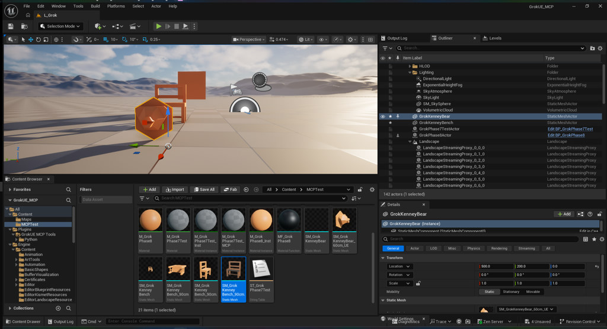

# Phase 8 — progress checkpoint

**Resume here.** Full plan: `Docs/PHASE8_PLAN.md`. Results: `Docs/NOTES.md` § Phase 8.

**Status:** Batches **H1 + H2 complete** — user confirmed (2026-06-21)  
**Level:** `/Game/Maps/L_Grok`  
**Asset folder:** `/Game/MCPTest/`

## Pipeline checklist

| # | Step | Asset / target | Status |
|---|------|----------------|--------|
| 1 | Parent material | `M_GrokPhase8` | **done** |
| 2 | Material function | `MF_GrokPhase8` (`GrokTint` scalar) | **done** |
| 3 | Wire MF into material | `M_GrokPhase8` → BaseColor | **done** |
| 4 | Material instance | `M_GrokPhase8_Inst` (`GrokTint=0.85`) | **done** |
| 5 | DataTable (string rows) | `DT_GrokPhase8_Strings` (3 rows) | **done** |
| 6 | Actor Blueprint + mesh + MI | `BP_GrokPhase8` + `GrokMesh` | **done** |
| 7 | Blueprint logic: ForEach → Print String | `write_graph_dsl` EventGraph | **done** |
| 8 | Spawn in L_Grok + PIE verify | `GrokPhase8Actor` | **done** |
| 9 | Web mesh import pipeline | `SM_GrokKenneyBench_90cm_UE`, `SM_GrokKenneyBear_60cm_UE` | **done** — H2 |

## Queue

**Empty** — Phase 8 integration targets met. **Next (Phase 2):** real-world DEM → heightmap → landscape (no Landscape MCP toolset yet).

## Kenney import recipe (H2 final)

```powershell
python ImportedAssets/scripts/scale_obj_to_ue_cm.py `
  "<kenney>.obj" "ImportedAssets/scaled/<name>_ue.obj" `
  --target-max-cm <height_cm> --kenney-ue
```

Then `StaticMeshTools.import_file` → spawn at **scale 1**, **rotation 0**, `M_GrokPhase8_Inst` on material slot.

| Flag / step | Purpose |
|-------------|---------|
| `--kenney-ue` | Y-up → Z-up, +X forward, +180° Z, face-winding fix |
| `--target-max-cm` | Bounds-sized import (uu = cm at actor scale 1) |
| `import_file` | **FBX/OBJ only** — glTF/GLB rejected by `FbxFactory` |

## Batch H2 — final viewport (user confirmed 2026-06-21)



| Asset | Target height | Spawn | refPath |
|-------|---------------|-------|---------|
| `SM_GrokKenneyBench_90cm_UE` | 90 cm (Z) | `GrokKenneyBench` (300,200,0) | `...StaticMeshActor_UAID_D8BBC1098290C2E602_1178606529` |
| `SM_GrokKenneyBear_60cm_UE` | 60 cm (Z) | `GrokKenneyBear` (500,200,0) | `...StaticMeshActor_UAID_D8BBC1098290C2E602_1167078528` |

## Done — do not re-run

| Batch | Items |
|-------|-------|
| H1 | Material + DT + BP + PIE — `Docs/images/phase8-h1-pie-datatable-prints.jpg` |
| H2 | Kenney web import — scaler + `import_file` + spawn; regression screenshots in `Docs/images/phase8-h2-*` |

**Assets:** `M_GrokPhase8`, `MF_GrokPhase8`, `M_GrokPhase8_Inst`, `DT_GrokPhase8_Strings`, `BP_GrokPhase8`, `SM_GrokKenneyBench_90cm_UE`, `SM_GrokKenneyBear_60cm_UE`