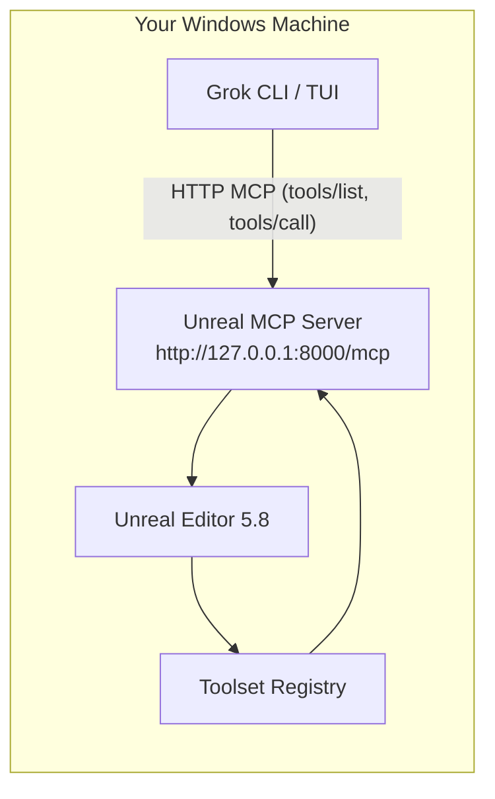
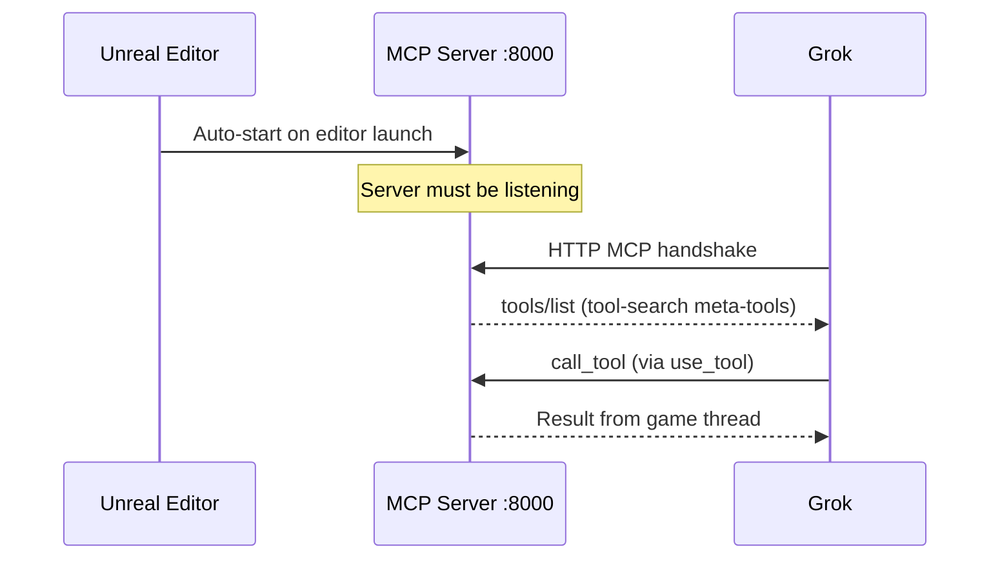

# GrokUE_MCP — Integration Plan

**Status:** Phase 5 complete — integration bridge verified end-to-end (see `Docs/NOTES.md`)
**Last updated:** 2026-06-20  
**Directed by:** Grok (Broken Gameplay Studios workflow)

---

## Context

This repository tracks a **blank Unreal Engine 5.8 Blueprint project** whose purpose is to establish a reliable, repeatable workflow for interfacing **Grok** with **Unreal Engine via MCP** (Model Context Protocol).

### Starting conditions

| Item | State |
|------|-------|
| Unreal project | Blank Blueprint project created (`GrokUE_MCP.uproject`), opened once at creation then closed |
| Engine version | UE 5.8 (engine association GUID in `.uproject`) |
| Developer experience | Many years of UE Blueprint work, some C++, **no prior work in UE 5.8** |
| Git repo | Empty repo cloned; project files copied in; `Docs/` created for plans and notes |
| MCP integration | **Not yet configured** — this plan is the roadmap |

### Goal

By the end of the initial phases, you should be able to:

1. Launch the Unreal Editor with the MCP server running locally.
2. Launch Grok from this project directory with the Unreal MCP server connected.
3. Ask Grok natural-language questions that invoke UE tools (e.g., "What actors are in the level?", "Spawn a cube at the origin").
4. Report hitches back to Grok with enough detail to debug quickly.

### What this project is *not* (yet)

- Not a gameplay prototype.
- Not a fork of community MCP projects (unless Epic's built-in plugin proves insufficient).
- Not production-ready — Unreal MCP is **Experimental** in UE 5.8.

---

## Architecture Overview



### Recommended path: Epic's built-in Unreal MCP (UE 5.8)

UE 5.8 ships an **experimental** plugin called **Unreal MCP** (internal name: `ModelContextProtocol`). It embeds an MCP server inside the editor process and exposes engine functionality as MCP Tools via the **Toolset Registry**.

**Why this path first:**

- Native to your engine version — no third-party C++ plugin compile step.
- HTTP transport on `http://127.0.0.1:8000/mcp` — Grok supports HTTP MCP natively.
- Epic-maintained; aligns with UE 5.8's AI tooling direction.
- Toolsets cover actors, materials, scene inspection, and more out of the box.

**Official documentation:**  
[Unreal MCP in Unreal Editor (UE 5.8)](https://dev.epicgames.com/documentation/unreal-engine/unreal-mcp-in-unreal-editor?lang=en-US)

### Fallback path: Community `chongdashu/unreal-mcp`

If Epic's plugin is unavailable, fails to enable, or lacks a capability you need immediately, the community project provides an alternative architecture:

- **C++ plugin** (`UnrealMCP`) — TCP server inside the editor (default port `55557`).
- **Python MCP bridge** — stdio MCP server that forwards to the C++ plugin.

This requires Visual Studio project generation, C++ compilation, and Python/`uv` setup. Documented at:  
[github.com/chongdashu/unreal-mcp](https://github.com/chongdashu/unreal-mcp)

**Decision:** Start with Epic's built-in plugin. Only pivot to the community stack if a documented blocker cannot be resolved within one session.

---

## Key Decisions

| Decision | Choice | Rationale |
|----------|--------|-----------|
| MCP server | Epic Unreal MCP (built-in) | Matches UE 5.8; HTTP transport; no compile step for initial bring-up |
| Grok config scope | Project-scoped `.grok/config.toml` | Committable, travels with repo, overrides global config |
| Transport | HTTP (`url` form) | Epic's server uses Streamable HTTP; Grok handles this natively — no stdio proxy |
| Tool discovery | Tool-search mode (default) | Epic advertises `list_toolsets` / `describe_toolset` / `call_tool` meta-tools; Grok should use `search_tool` / `use_tool` to find and invoke them |
| Serial tool calls | One at a time | Epic executes tools on the game thread serially; overlapping calls can deadlock or fail |
| Repo hygiene | Standard UE `.gitignore` | `Saved/`, `Intermediate/`, `DerivedDataCache/`, `Binaries/` stay local |

---

## Phase 0 — Environment Verification

**You do this once before touching MCP.**

### 0.1 Confirm UE 5.8 launches the project

1. Double-click `GrokUE_MCP.uproject` (or open via Epic Games Launcher → Library).
2. If prompted to rebuild modules, allow it.
3. Confirm the editor opens to the default level without errors.
4. Check **Window → Output Log** for red errors.

**Pass criteria:** Editor opens, no fatal errors in Output Log.

### 0.2 Confirm Grok works from this directory

Open PowerShell:

```powershell
cd F:\git\GrokUE_MCP
grok --version
grok inspect
```

**Pass criteria:** Grok launches; `grok inspect` shows your configured MCP servers (global ones are fine for now).

### 0.3 Note your paths (for hitch reports)

| Path | Value |
|------|-------|
| Project root | `F:\git\GrokUE_MCP` |
| UE project file | `F:\git\GrokUE_MCP\GrokUE_MCP.uproject` |
| Grok config (user) | `C:\Users\Brian\.grok\config.toml` |
| Grok config (project) | `F:\git\GrokUE_MCP\.grok\config.toml` |
| MCP endpoint (default) | `http://127.0.0.1:8000/mcp` |

---

## Phase 1 — Enable Unreal MCP in the Editor

All steps happen inside the Unreal Editor.

### 1.1 Enable the plugin

1. **Edit → Plugins**
2. Search: `Unreal MCP` (or `Model Context Protocol`)
3. Check **Enabled**
4. The **Toolset Registry** dependency enables automatically.
5. **Restart the editor** when prompted.

If the plugin does not appear:

- Confirm you are on UE **5.8** (Help → About Unreal Editor).
- Check **Edit → Plugins → Built-in** filter is not hiding experimental plugins.
- Report this as a blocker — may need engine install repair or fallback path.

### 1.2 Configure auto-start

1. **Edit → Editor Preferences**
2. **General → Model Context Protocol**
3. Enable **Auto Start Server**
4. Defaults: port `8000`, path `/mcp`
5. Restart the editor (or run console command below).

**Manual start alternative** (backtick console):

```
ModelContextProtocol.StartServer
```

Optional port override:

```
ModelContextProtocol.StartServer 8000
```

### 1.3 Verify server is listening

After editor loads, check **Output Log**:

- Filter by `LogModelContextProtocol`
- Look for bind address / port confirmation

For verbose logging:

```
Log LogModelContextProtocol Verbose
```

**Pass criteria:** Log shows server bound to `http://127.0.0.1:8000/mcp` (or your configured port).

### 1.4 Optional — MCP Inspector smoke test

Before involving Grok, validate the server with the official inspector:

```powershell
npx @modelcontextprotocol/inspector
```

Point it at `http://127.0.0.1:8000/mcp` using **Streamable HTTP** transport. You should see toolsets/tools listed and be able to invoke a simple read-only tool.

**Pass criteria:** Inspector connects and `tools/list` (or tool-search meta-tools) returns data.

---

## Phase 2 — Connect Grok to Unreal MCP

Grok loads MCP servers from several sources. For this project we use **project-scoped** config so the setup is reproducible and committable.

### 2.1 Project-scoped Grok config (already templated)

File: `.grok/config.toml`

```toml
[mcp_servers.unreal-mcp]
url = "http://127.0.0.1:8000/mcp"
enabled = true
startup_timeout_sec = 30
tool_timeout_sec = 120
```

Grok walks up from the current directory to the git root and loads this file automatically when you run `grok` from anywhere inside the repo.

**Alternative — CLI one-liner** (writes to user config instead of project):

```powershell
grok mcp add --transport http --scope project unreal-mcp http://127.0.0.1:8000/mcp
```

Run that from `F:\git\GrokUE_MCP` if you prefer CLI over editing the file.

### 2.2 Alternative — `.mcp.json` in project root

Epic's editor can generate client configs for Claude Code, Cursor, VS Code, Gemini, and Codex — **not Grok**. You can still use the standard format manually:

```json
{
  "mcpServers": {
    "unreal-mcp": {
      "type": "http",
      "url": "http://127.0.0.1:8000/mcp"
    }
  }
}
```

Grok also reads `.mcp.json` from the project root (lower priority than `.grok/config.toml`). Having both is fine; project-scoped TOML takes precedence for the same server name.

### 2.3 Startup order (critical)



1. **Start Unreal Editor first** — wait until MCP server log confirms bind.
2. **Then start Grok** from the project root:

   ```powershell
   cd F:\git\GrokUE_MCP
   grok
   ```

3. In Grok TUI, run `/mcps` and confirm `unreal-mcp` shows as enabled with tools listed.
4. If the server list looks stale after editing config, press `r` to refresh.

### 2.4 Diagnose connectivity

```powershell
cd F:\git\GrokUE_MCP
grok mcp doctor unreal-mcp
grok inspect
```

Check stderr log if handshake fails:

```powershell
Get-Content "$env:USERPROFILE\.grok\logs\mcp\unreal-mcp.stderr.log" -Tail 50
```

---

## Phase 3 — First Connection Tests

Run these prompts in Grok **after** both editor and MCP server are running. These are ordered from safest (read-only) to more invasive.

### 3.1 Read-only sanity checks

| # | Prompt | Expected outcome |
|---|--------|------------------|
| 1 | "What MCP tools do you have from the unreal-mcp server?" | Grok lists toolsets or meta-tools (`list_toolsets`, etc.) |
| 2 | "Use the Unreal MCP to list available toolsets." | Returns toolset names/descriptions |
| 3 | "What actors are in the current level?" | Returns actor list from the open level |
| 4 | "What do I have selected in the editor?" | Returns selection info or empty selection |

### 3.2 Light write test

| # | Prompt | Expected outcome |
|---|--------|------------------|
| 5 | "Spawn a static mesh cube at the world origin." | Cube appears in viewport |
| 6 | "Focus the viewport on the cube you just created." | Camera moves to actor |

### 3.3 If a test fails

Capture and report (see **Hitch Reporting Template** below):

- Which prompt number failed
- Grok's error message
- Relevant `LogModelContextProtocol` lines from UE Output Log
- Output of `grok mcp doctor unreal-mcp`

**Important constraint:** Issue **one tool call at a time**. Do not ask Grok to spawn 10 actors in parallel — Epic's server serializes on the game thread.

---

## Phase 4 — Establish a Repeatable Workflow

Once basic connectivity works, adopt this daily workflow:

### 4.1 Session startup checklist

- [ ] Open `GrokUE_MCP.uproject`
- [ ] Confirm MCP server auto-started (Output Log)
- [ ] Open PowerShell in `F:\git\GrokUE_MCP`
- [ ] Run `grok`
- [ ] `/mcps` → verify `unreal-mcp` enabled
- [ ] Run prompt #1 from Phase 3 as a health check

### 4.2 Session shutdown

- Close Grok normally.
- Save and close Unreal Editor (MCP server stops with editor).

### 4.3 Optional — In-editor terminal workflow

Epic documents running an AI agent from the editor's **Terminal** plugin so everything stays in one window. This is optional for Grok but worth exploring later:

1. Enable **Terminal** plugin (Edit → Plugins).
2. Editor Preferences → General → Terminal → add startup commands:
   - `set TERM=xterm-256color`
   - `cd /d "F:\git\GrokUE_MCP"`
   - `grok`

---

## Phase 5 — Grow Capabilities (Future)

After the basic bridge is stable:

| Milestone | Description |
|-----------|-------------|
| **Custom Python toolsets** | Author project-specific tools under `Plugins/<YourPlugin>/Content/Python/` using `unreal.ToolsetDefinition` |
| **Refresh workflow** | After adding tools: `ModelContextProtocol.RefreshTools` in UE console, reconnect Grok |
| **Project rules** | Add `AGENTS.md` at repo root with Grok-specific conventions for this UE project |
| **Grok skill** | Create a `grok-ue-mcp` skill with hitch-playbook and common prompts |
| **CI / headless** | Explore `-ModelContextProtocolStartServer` CLI flag for automation (advanced) |

### Authoring tools — quick reference

Python toolsets live in any plugin's `Content/Python/` and are discovered by the Toolset Registry at startup. After changes:

```
ModelContextProtocol.RefreshTools
```

C++ toolsets require full editor restart for new `UFUNCTION` declarations (Live Coding limitation).

---

## UE 5.8 Notes for Experienced (Pre-5.8) Developers

A few things that may be new or different in 5.8:

| Topic | What to expect |
|-------|----------------|
| **Experimental plugins** | Unreal MCP and Toolset Registry are experimental — APIs may change between engine patches. |
| **Python toolsets** | First-class for MCP tool authoring; many shipped toolsets are Python, not C++. |
| **Tool-search mode** | Default behavior — agents discover tools lazily via meta-tools, not a flat `tools/list` of hundreds of entries. |
| **ModelingToolsEditorMode** | Already enabled in this project's `.uproject` — standard for blank templates, unrelated to MCP. |
| **No C++ project module yet** | This is Blueprint-only. Adding C++ (for custom toolsets) requires adding a C++ class via Tools → New C++ Class, which generates `Source/` and a `.sln`. |

---

## Fallback Plan — Community `unreal-mcp`

Trigger fallback if:

- Unreal MCP plugin is missing from your 5.8 install.
- Plugin fails to enable or crashes the editor.
- HTTP server never binds after clean troubleshooting.

High-level fallback steps:

1. Clone `https://github.com/chongdashu/unreal-mcp`
2. Copy `MCPGameProject/Plugins/UnrealMCP` → `F:\git\GrokUE_MCP\Plugins\UnrealMCP`
3. Right-click `.uproject` → Generate Visual Studio project files
4. Build **Development Editor** in Visual Studio
5. Enable **UnrealMCP** plugin in editor
6. Set up Python server (`uv` + `unreal_mcp_server.py`)
7. Configure Grok with **stdio** transport pointing at the Python server (not HTTP)

Document the pivot in `Docs/NOTES.md` if it happens.

---

## Hitch Reporting Template

When something fails, paste this block to Grok:

```
## Hitch Report

**Phase/step:** (e.g., Phase 1.1 — Enable plugin)
**Date/time:**

### Expected
(what should have happened)

### Actual
(what happened instead)

### Environment
- UE version: (Help → About)
- Grok version: (grok --version)
- MCP endpoint: http://127.0.0.1:8000/mcp
- Editor running: yes/no
- Grok launched from F:\git\GrokUE_MCP: yes/no

### Logs
- UE Output Log (LogModelContextProtocol lines):
  (paste)

- grok mcp doctor unreal-mcp:
  (paste)

- Grok error message:
  (paste)
```

---

## PR Plan — Incremental Repo Changes

These are the expected commits as you progress:

| PR / Commit | Contents | Depends on |
|-------------|----------|------------|
| **C1 — Initial scaffold** | `.uproject`, `Config/`, `Content/`, `.gitignore`, `Docs/PLAN.md`, `.grok/config.toml` | — |
| **C2 — MCP verified** | `Docs/NOTES.md` with Phase 1–3 results, screenshots optional | C1 + local MCP working |
| **C3 — AGENTS.md** | Grok project rules for UE conventions | C2 |
| **C4 — Custom toolset** | First Python toolset plugin for project-specific automation | C3 |

---

## Open Questions

Resolve these during Phase 1–3 and record answers in `Docs/NOTES.md`:

1. **Does the Unreal MCP plugin appear and enable cleanly on your exact 5.8 build?**
2. **Does port 8000 conflict with another local service?** (If yes, change port in Editor Preferences and update `.grok/config.toml`.)
3. **Does Grok's `search_tool` / `use_tool` flow work with Epic's tool-search meta-tools, or do we need to disable tool-search mode?** (`Enable Tool Search` in Editor Preferences — try default first.)
4. **Is HTTP localhost connectivity blocked by firewall/security software?**
5. **Do you want project files to stay at `F:\git\GrokUE_MCP` or symlink from `F:\UEDEV\GrokUE_MCP`?** (Currently copied; pick one canonical location.)

---

## Immediate Next Steps (for you)

1. **Commit and push** the scaffold (project files + `Docs/PLAN.md` + `.grok/config.toml`).
2. **Phase 0:** Open the project in UE 5.8, confirm clean launch.
3. **Phase 1:** Enable Unreal MCP, auto-start, verify Output Log.
4. **Phase 2:** Launch Grok from `F:\git\GrokUE_MCP`, check `/mcps`.
5. **Phase 3:** Run the six test prompts above.
6. **Report back** with results or a filled Hitch Report.

Grok will iterate on the plan based on what you find.

---

## References

- [Unreal MCP in Unreal Editor — UE 5.8 Docs](https://dev.epicgames.com/documentation/unreal-engine/unreal-mcp-in-unreal-editor?lang=en-US)
- [Model Context Protocol Specification](https://modelcontextprotocol.io)
- Grok MCP Servers Guide — `C:\Users\Brian\.grok\docs\user-guide\07-mcp-servers.md`
- [Community unreal-mcp (fallback)](https://github.com/chongdashu/unreal-mcp)
- [MCP Inspector](https://www.npmjs.com/package/@modelcontextprotocol/inspector)